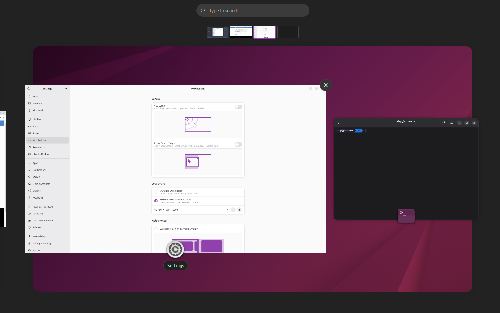

# Focus Under Cursor on Overview Exit

Focus the window under your cursor when exiting GNOME Overview — just like macOS Mission Control.



## What It Does

**The Problem:** GNOME always returns focus to the previously focused window when you exit Overview, even if your cursor is somewhere else.

**The Solution:** This extension focuses whatever window your cursor is pointing at when you close Overview.

## How It Works

| Your Action | Result |
|-------------|--------|
| Hover a window thumbnail → Close Overview | That window gets focus ✅ |
| Move cursor over empty space → Close Overview | Window under cursor gets focus ✅ |
| Don't move cursor → Close Overview | Focus stays unchanged ✅ |

## Installation

### Option 1: extensions.gnome.org (Recommended)

Install from the official GNOME Extensions site:
https://extensions.gnome.org/extension/9578/focus-under-cursor-on-overview-exit/

### Option 2: One-Line Install

```bash
curl -fsSL https://raw.githubusercontent.com/dalpat/focus-under-cursor/main/install.sh | bash
```

### Option 3: Manual Install

```bash
git clone https://github.com/dalpat/focus-under-cursor.git
cd focus-under-cursor
./install.sh
```

**Note:** On Wayland, log out and back in. On X11, press `Alt+F2`, type `r`, press Enter.

## Settings

Open settings with:
```bash
gnome-extensions prefs focus-under-cursor@extension
```

### Available Options

**Focus window under cursor when no preview was hovered**

Controls whether hovering a window preview focuses it when you haven't moved your pointer.

- **ON**: Hovering any window preview focuses it immediately, even if you haven't moved your mouse since opening Overview
- **OFF** (default): Focus only changes if you actually move your pointer onto a preview

**Example:** If you open Overview with Super key and your mouse happens to be over a window preview, but you don't move the mouse:
- Setting **ON**: That window gets focused when you close Overview
- Setting **OFF**: Focus stays on whatever window was active before

## Compatibility

Works with GNOME Shell 45, 46, 47, 48, 49, and 50.

## License

GPL-2.0-or-later
